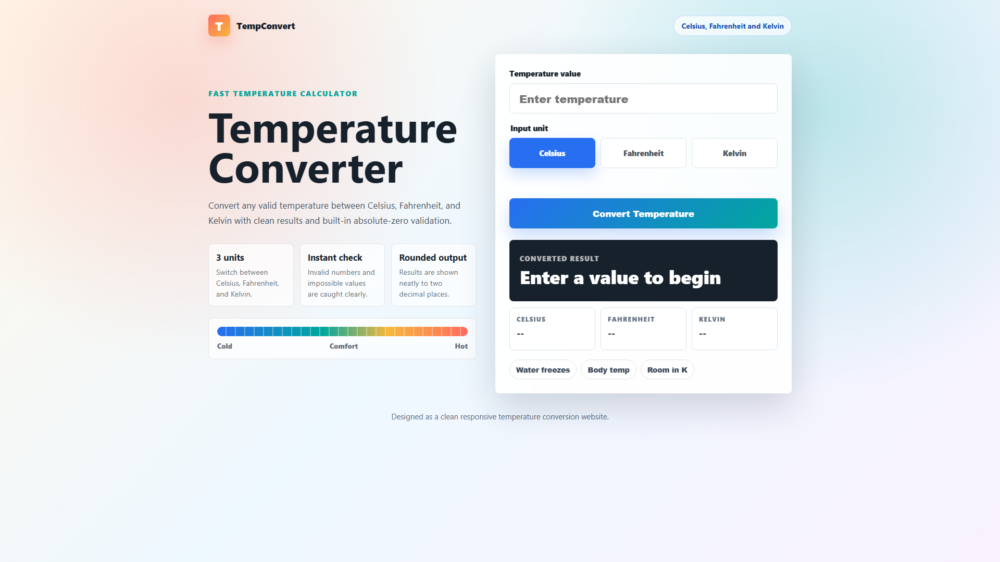

# Adhyangupta_level1task3

Temperature Converter website created using HTML, CSS, and JavaScript.

## Live Demo Preview

The screenshot above shows the temperature converter website working with Celsius, Fahrenheit, and Kelvin conversion options.

## Project Files

- `index.html` - main website file
- `images/live-demo.png` - preview image displayed in this README

## Features

- Temperature input field with number validation
- Unit selection for Celsius, Fahrenheit, and Kelvin
- Convert button for calculating results
- Result display cards for all temperature units
- Absolute-zero validation
- Responsive website layout

## How to View

Open `index.html` in a web browser.
